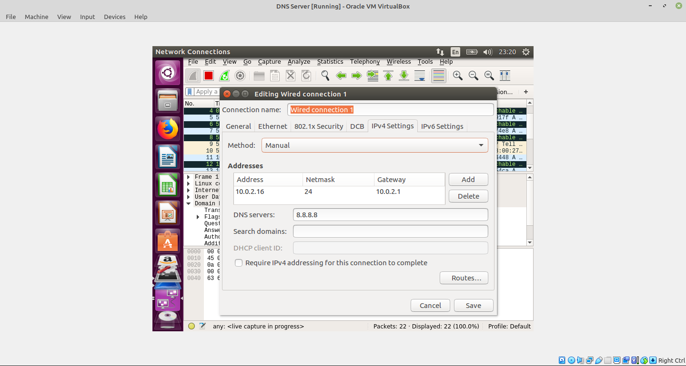
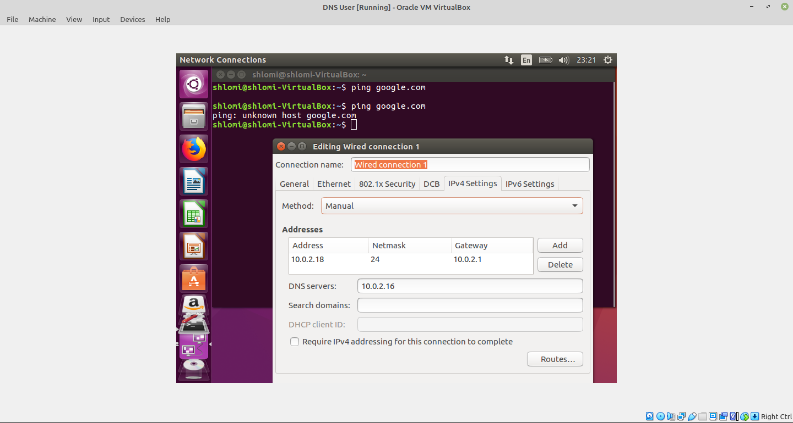
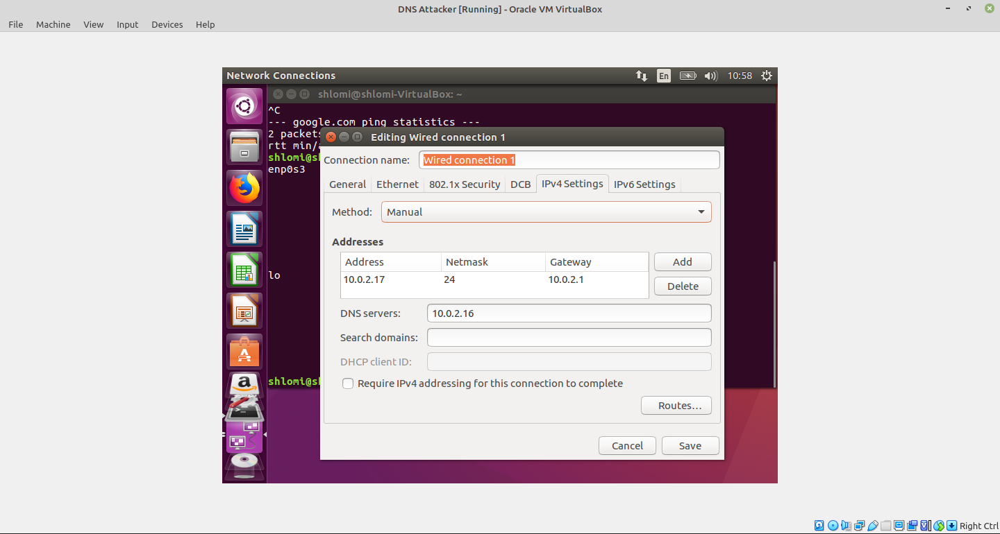
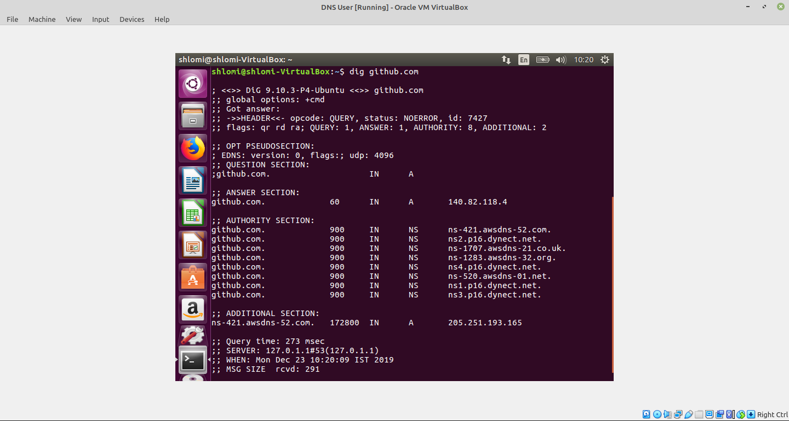
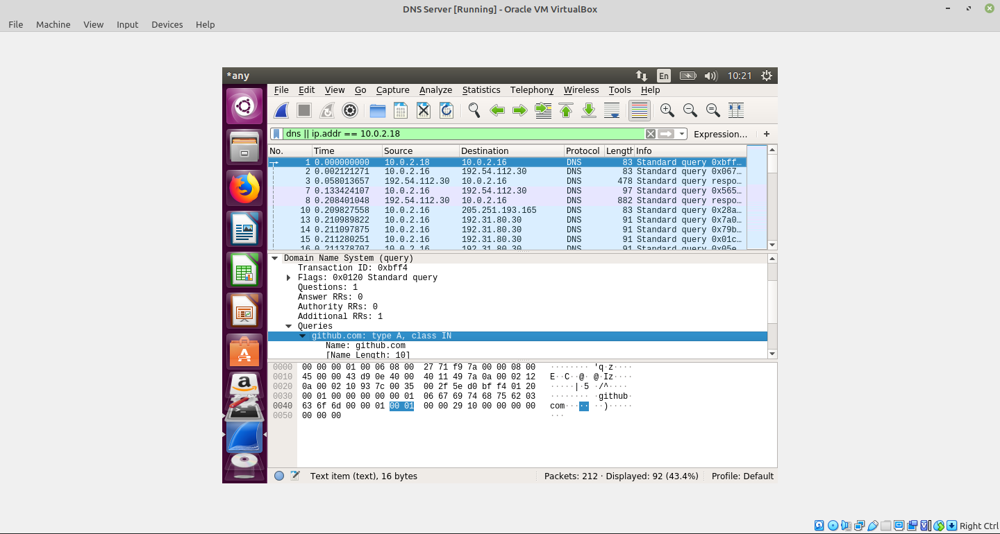

# kaminsky-attack
kaminsky-attack - DNS cache poisoning with extremly high performance

This attack is well-known and STILL unfixed. Though some progress was made to create NEW DNS protocols for protection against such attacks. Though in reality they are hard to execute. This is time-based attack.

The main victim is the DNS server. Which then the attacker can redirect DNS requests to his evil website. 

# Lab Setup

1. Clone 3 Ubuntu 16.04 (or later) machines
2. Lab network configuration
	1. DNS Server IP is: 10.0.2.16
	2. DNS Attacker IP is: 10.0.2.17
	3. DNS User IP is: 10.0.2.18
3. All machines have access to the internet
4. All machines have access to each other (same network, subnet)

## DNS Server
Settings:

## DNS User machine
Settings:

## DNS Attacker
Settings:

## Test DNS server and DNS user talking to each other
User sends DNS requests to DNS server (using dig):

DNS server recevies requests:

